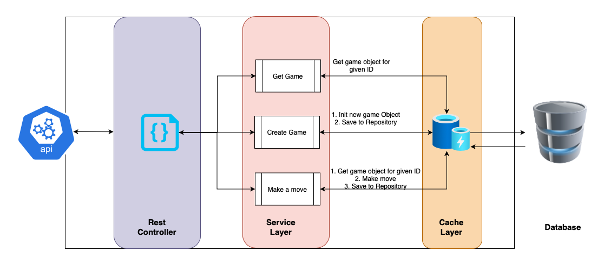
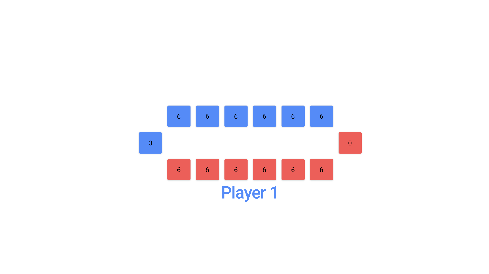

# Mancala Game

This project is an implementation of Mancala game using Java.

### Technologies Used

* Java 11
* Spring Boot 2
* Spring Data JPA
* MySQL - For game persistence
* Caffeine - In-Memory Cache
* Swagger - For API Docs
* Flutter - For UI
* JUnit5
* Mockito
* H2 database - For test cases
* JaCoCo - For Code Coverage

### Features at a Glance

* Two player game
* Well covered test cases with 85% coverage
* Game UI designed with Flutter Web. Can be easily ported to mobile application as well with the same code
* Option to continue any abandoned game
* REST API based game

### Configurations
* Both the number of pits and initial number of coins in each pit are configurable from [properties](src/main/resources/application.properties)

### Assumptions

* Cache is coded to an interface. It can be easily replaced with a distributed cache in the future
* Cache layer is designed with the assumption that there is only one app server. When this application is horizontally scaled 
  with multiple app servers, a timestamp based cache invalidation strategy or a distributed cache should be used.
* Ambiguity : In the current design, if a player inserts his last coin in his own empty pit, he will steal his coins and opponents coins
  and puts in his large pit. In some versions of Mancala, stealing is not allowed if the opponent's pit is empty.

### Future Improvements

* Right now, the jacoco code coverage is 85%. In future, it can be improved to 95 - 100%
* Undo, Redo of moves can be added
* Hints can be shown to user to assist him in making better moves
* Computer can be made as opponent in the place of another human
* Number of pits and the initial number of coins in each pit can be configurable while creating a game
* Containerization of deployment can be done
* CI/CD with Travis can be done

## To Build

### Server Dependencies:
* OpenJDK 11
* MySQL 8. Username and password are configurable in [properties](src/main/resources/application.properties) 
* MySQL CLI client

### Client Dependencies:
* Python 2 or Python 3 to server the html content

## To Run

### Server
* Run the SQL Command `create database mancala;`
* Switch to project directory on terminal
* `./mvnw clean install`
* `cd target/`
* `java -jar mancala-0.0.1-SNAPSHOT.jar`

### Client
* Switch to project directory on terminal
* `cd web/`
* `python -m SimpleHTTPServer 8000` if python 2 is installed
  (or)
* ` python -m http.server 8000` if python 3 is installed
* Game can be played by visiting the url http://localhost:8000

## API Docs
* Swagger API Docs can be accessed by opening http://localhost:8080/swagger-ui/# . This requires the application to be in running state.

### Architecture

### UI
